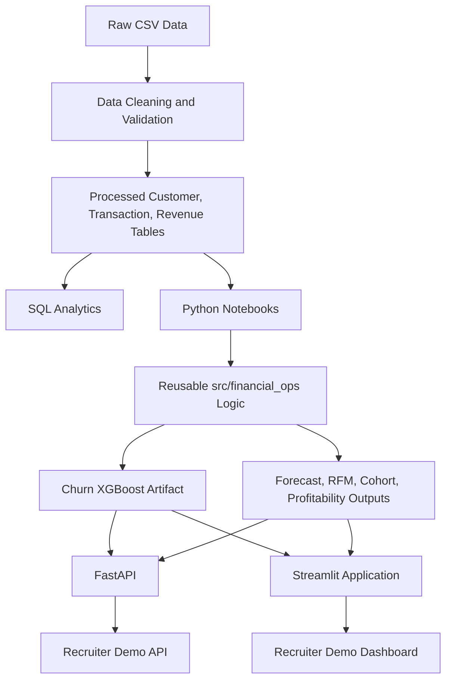

# Financial Operations Analytics & Predictive ML

An end-to-end financial analytics and predictive ML system for revenue forecasting, customer churn prediction, RFM segmentation, cohort analysis, profitability analysis, explainable ML, and customer-level business decision support.

This project turns 20,000 customer records, 329,202 transactions, and 36 months of revenue history into a professional Streamlit dashboard, a lightweight FastAPI backend, reusable Python analytics/ML modules, and Docker-ready deployment assets.

## Features

- Executive Overview with revenue, profit, churn, customer, cohort, and segment KPIs
- Customer Churn Prediction using the extracted XGBoost pipeline from the churn notebook
- Customer 360 combining customer attributes, RFM, churn risk, profitability, cohort context, and recent transactions
- Revenue Forecasting using the existing ARIMA forecast outputs
- ML Model Lab with actual model comparison, cross-validation, feature importance, and SHAP outputs
- Business Insights translating analytics into retention, profitability, cohort, and segment recommendations
- FastAPI endpoints for churn prediction, customer lookup, model metrics, and revenue forecast
- Docker and Docker Compose support for local demo deployment

## Key Results

| Metric | Actual Project Result |
|---|---:|
| Customers analyzed | 20,000 |
| Transactions analyzed | 329,202 |
| Total revenue | $530.3M |
| Total profit | $438.9M |
| Active customers | 14,440 |
| Observed churn rate | 27.8% |
| High-risk customers flagged | 5,284 |
| Best churn model | XGBoost |
| XGBoost ROC-AUC | 0.988 |
| XGBoost F1 | 0.936 |
| Forecast horizon | 12 months |
| Forecasted revenue | $709.5M |
| Month-1 retention | 93.1% |
| Month-6 retention | 70.3% |
| Top RFM revenue segment | Big Spenders, $226.2M |

## Application Pages

| Page | What it demonstrates |
|---|---|
| Executive Overview | Business KPIs, revenue trend, churn distribution, RFM revenue concentration, profitability, cohort retention |
| Customer Churn Prediction | Live XGBoost inference with actual model features and risk-based recommendation |
| Customer 360 | Customer-level decision support across churn, value, RFM, profitability, cohort, and transaction history |
| Revenue Forecasting | Historical revenue, exported ARIMA forecast, forecast KPIs, and model comparison context |
| ML Model Lab | Model selection, holdout metrics, cross-validation, feature importance, and SHAP explainability |
| Business Insights | Dataset-backed recommendations from churn, cohort, RFM, profitability, and executive outputs |

## ML Models

### Churn Prediction

The churn workflow is preserved in `notebooks/04_Churn_Prediction.ipynb` and extracted into reusable code in `src/financial_ops/churn_model.py`.

Actual model workflow:

- Target: existing `churn` column from `financial_customers_clean.csv`
- Leakage exclusions: `customer_id`, raw date strings, `is_active`, `risk_score`, `customer_segment`, `customer_profitability`
- Feature engineering: date parts, transaction aggregates, transaction behavior rates, revenue/profit ratios, support and login ratios
- Model comparison: Baseline, Logistic Regression, Decision Tree, Random Forest, XGBoost
- Best model: XGBoost by ROC-AUC
- Saved artifact: `models/churn_xgboost_pipeline.joblib`
- Raw model features: 57

Actual holdout metrics from `outputs/model_evaluation_metrics.csv`:

| Model | Accuracy | Precision | Recall | F1 | ROC-AUC |
|---|---:|---:|---:|---:|---:|
| XGBoost | 0.965 | 0.949 | 0.924 | 0.936 | 0.988 |
| Logistic Regression | 0.956 | 0.923 | 0.919 | 0.921 | 0.984 |
| Random Forest | 0.953 | 0.956 | 0.872 | 0.912 | 0.981 |
| Decision Tree | 0.944 | 0.885 | 0.918 | 0.901 | 0.969 |
| Baseline | 0.722 | 0.000 | 0.000 | 0.000 | 0.500 |

### Revenue Forecasting

The forecasting workflow is preserved in `notebooks/03_Revenue_Time_Series_Forecasting.ipynb`.

Actual workflow:

- Target: monthly `net_revenue`
- Data: 36 monthly observations
- Validation: date parsing, monthly frequency checks, stationarity review, ACF/PACF, seasonal decomposition
- Models evaluated in notebook: baseline and ARIMA, with Prophet attempted only when installed
- Final exported forecast: `outputs/forecast_results.csv`
- Forecast summary: `outputs/forecast_summary.txt`

## Explainability

The project includes both model feature importance and SHAP output:

- `outputs/churn_feature_importance.csv`
- `outputs/shap_feature_importance.csv`
- `outputs/figures/feature_importance.png`
- `outputs/figures/shap_feature_impact.png`

The app surfaces these in the ML Model Lab and uses lightweight customer-specific driver checks for live prediction explanations.

## Architecture



## Tech Stack

| Layer | Tools |
|---|---|
| Analytics | Python, pandas, numpy |
| Visualization | Plotly, matplotlib, seaborn |
| Machine Learning | scikit-learn, XGBoost |
| Explainability | SHAP, feature importance |
| Forecasting | statsmodels ARIMA notebook workflow, exported forecast outputs |
| API | FastAPI, Pydantic, Uvicorn |
| App | Streamlit |
| SQL | PostgreSQL scripts with CTEs, constraints, and business queries |
| Deployment | Docker, Docker Compose |
| Testing | pytest |

## Project Structure

```text
Financial-Operations-Analytics-main/
|-- app/
|   |-- dashboard.py
|   `-- pages/
|       |-- overview.py
|       |-- churn.py
|       |-- customer360.py
|       |-- forecasting.py
|       |-- model_lab.py
|       `-- insights.py
|-- api/
|   `-- main.py
|-- src/financial_ops/
|   |-- analytics.py
|   |-- churn_model.py
|   |-- data.py
|   |-- forecasting.py
|   `-- paths.py
|-- scripts/
|   `-- train_churn_model.py
|-- models/
|   `-- churn_xgboost_pipeline.joblib
|-- tests/
|   `-- test_core.py
|-- data/
|   |-- raw/
|   `-- processed/
|-- notebooks/
|-- outputs/
|-- sql/
|-- Dockerfile
|-- docker-compose.yml
`-- requirements.txt
```

## Local Setup

```bash
python3 -m venv .venv
source .venv/bin/activate
pip install -r requirements.txt
python scripts/train_churn_model.py
```

Run the Streamlit application from the project root:

```bash
PYTHONPATH=src .venv/bin/python -m streamlit run app/dashboard.py
```

Run the FastAPI backend:

```bash
PYTHONPATH=src .venv/bin/python -m uvicorn api.main:app --reload --port 8000
```

Run tests:

```bash
PYTHONPATH=src .venv/bin/python -m pytest -q
```

## API Documentation

When the API is running, interactive docs are available at:

```text
http://localhost:8000/docs
```

Endpoints:

| Method | Endpoint | Purpose |
|---|---|---|
| GET | `/health` | API health check |
| POST | `/predict/churn` | Predict churn probability and risk level |
| GET | `/customer/{customer_id}` | Return Customer 360 analytics |
| GET | `/model/metrics` | Return churn model metrics, CV metrics, feature importance, SHAP output |
| GET | `/forecast/revenue?horizon=12` | Return historical and forecasted revenue |

Example churn request:

```json
{
  "customer_id": "CUST_000003",
  "features": {
    "days_since_last_transaction": 176,
    "usage_score": 46.6,
    "login_frequency": 14.1,
    "nps_score": 11,
    "subscription_plan": "Professional",
    "contract_type": "Annual"
  }
}
```

## Docker

Run both the Streamlit app and FastAPI service:

```bash
docker compose up --build
```

Services:

- Streamlit: `http://localhost:8501`
- FastAPI: `http://localhost:8000`
- API docs: `http://localhost:8000/docs`

Docker uses `requirements-app.txt`, a smaller runtime dependency file for the Streamlit and FastAPI demo. The full `requirements.txt` remains available for notebooks, forecasting experiments, and extended analysis.

## Deployment

Simple portfolio deployment path:

1. Push the repository to GitHub.
2. Deploy Streamlit with Streamlit Community Cloud using `app/dashboard.py` as the entry point.
3. Optional: deploy the FastAPI backend separately on Render, Railway, or a similar low-cost service using:

```bash
uvicorn api.main:app --host 0.0.0.0 --port $PORT
```

4. Replace `YOUR_LIVE_DEMO_URL` at the top of this README with the deployed Streamlit URL.

The Streamlit app reads the same local data, outputs, and model artifact directly, so a separate API deployment is optional for the recruiter demo.

## Screenshots

Add screenshots to `screenshots/` after deployment or local review:

- `screenshots/executive-overview.png`
- `screenshots/churn-prediction.png`
- `screenshots/customer-360.png`
- `screenshots/revenue-forecasting.png`
- `screenshots/model-lab.png`

## SQL Layer

The `sql/` folder preserves the PostgreSQL analytics layer:

- `01_database_setup.sql`
- `02_create_tables.sql`
- `03_import_clean_data.sql`
- `04_business_questions.sql`

The import script now uses relative CSV paths and should be run from the project root.

## Future Improvements

- Add deployed screenshots after the live demo is published
- Persist a regenerated forecast model-comparison CSV after installing the full forecasting stack
- Add threshold tuning controls for churn campaign capacity planning
- Add a small batch scoring command for campaign exports
- Add CI once the repository is pushed to GitHub

## Recruiter Value

This project demonstrates the full applied analytics path:

- Data ingestion, validation, and cleaning
- SQL schema design and business queries
- Exploratory analysis and KPI design
- Revenue forecasting
- Supervised churn modeling and model comparison
- Explainability through feature importance and SHAP outputs
- Customer segmentation and cohort retention analysis
- Profitability analysis
- Reusable Python modules
- Interactive Streamlit application
- FastAPI backend
- Docker-ready local deployment
